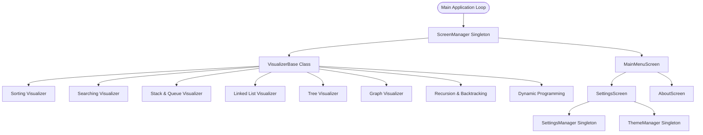

# Data Structures & Algorithms (DSA) Visualizer

A stunning, interactive desktop application built in C++17 and SFML for visualizing fundamental Data Structures and Algorithms. The application incorporates a unified step-recording simulation playback engine, customizable visual themes, real-time debugging panels, educational insights overlays, and extensive export capabilities.



---

## Key Features

### 1. Interactive Modules
- **Sorting Visualizer**: Bubble Sort, Selection Sort, Insertion Sort, Merge Sort, and Quick Sort. Displays swaps, comparisons, array size adjusters, and completion summaries.
- **Searching Visualizer**: Linear Search and Binary Search on sorted/unsorted data. Highlights searching bounds, comparisons count, target numeric overrides, and failure overlays.
- **Stack & Queue**: Simulates push, pop, enqueue, dequeue, front, and rear operations with vertical stack animations and horizontal queue transitions.
- **Linked List**: Singly, Doubly, and Circular linked lists. Animates pointers redirecting, memory addresses labels, and step histories logs.
- **Binary Tree**: BST and AVL trees with automatic rotations (LL, RR, LR, RL) balancing, random inputs, and traversal paths.
- **Graph Visualizer**: Interactive node map creation (drag vertices, edit edge weights, add/delete edges). BFS, DFS, Dijkstra, Bellman-Ford, Prim, and Kruskal execution traces.
- **Recursion & Backtracking**: Fibonacci, Factorial, Binary Search, N-Queens, and Sudoku. Displays dynamic recursive call trees, stack frames pushing/popping, backtracking paths, and execution logs timeline.
- **Dynamic Programming (DP)**: Fibonacci Memoization, Fibonacci Tabulation, 0/1 Knapsack, Longest Common Subsequence (LCS), Coin Change, Matrix Chain, and Edit Distance. Features 2D state grids, parent-child dependency line links, and final result backtracking traces.

### 2. Global Shortcuts & Controls
- **Play/Pause**: Run the algorithm sequentially or freeze execution.
- **Step**: Manually jump forward one step at a time.
- **Reset**: Roll back modifications to starting values.
- **Speed & Size**: Adjust visualizer pace rates and parameters on the fly.

### 3. Theme Manager & Accessibility
- Support for **Dark Theme**, **Light Theme**, and **High Contrast Mode** (black backgrounds, neon highlights, white borders) for maximum readability.
- Configurable font scales.

---

## Keyboard Shortcuts

| Shortcut | Action Description |
| :---: | :--- |
| **`Space`** | Toggle animation playback Play / Pause |
| **`S`** | Step forward one instruction single frame |
| **`R`** | Reset visualization state arrays and queues |
| **`T`** | Cycle visual themes (Dark $\rightarrow$ Light $\rightarrow$ High Contrast) |
| **`H`** | Toggle Help & Shortcuts user guide modal |
| **`P`** | Export screenshot of current viewport to `dsa_screenshot.png` |
| **`D`** | Export data serialization properties to `dsa_data.json` |

---

## Installation & Build Instructions

### Prerequisites
- **CMake** (v3.14 or higher)
- **C++17 compiler** (gcc, clang, or MSVC)
- Git (FetchContent downloads SFML source code automatically)

### Compiling on Windows/Linux/macOS
1. Clone the project workspace:
   ```bash
   git clone https://github.com/Parssharma/DSA-visualizer.git
   cd DSA-visualizer
   ```
2. Build the project:
   ```bash
   cmake -B build
   cmake --build build
   ```
3. Run the visualizer:
   ```bash
   ./build/DSA_Visualizer.exe
   # Or on Windows, double-click run.bat
   ```

---

## Project Structure
- `include/core/`: Headers defining visualizer screens, managers, and system configurations.
- `src/core/`: Source files implementing step recorders, visualizer layouts, and singletons.
- `include/ui/` & `src/ui/`: Custom UI button shapes, card panels, sliders, and overlays.
- `assets/fonts/`: Fonts used for rendering interface typography.